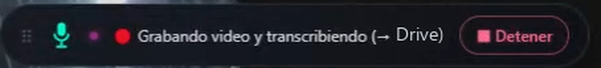

# Transcripción y grabación automática de llamadas de Meet

Extensión de Chrome que detecta la entrada a una llamada, la transcribe y graba sola, y deja un Google Doc por llamada con resumen ejecutivo, puntos clave y pendientes como casillas reales — sin pasos manuales y sin bloquear el "Presentar pantalla".

## Demo

El widget durante una llamada:



Se arrastra, recuerda su posición, y dice en texto explícito qué está haciendo — "Transcribiendo" o "Grabando video y transcribiendo" — para que nunca haya duda de si el video está entrando o no. El destino entre paréntesis es el selector de Drive: cada llamada se puede enrutar a una unidad distinta.

## Cómo funciona

```
Entrada a la llamada ──► detectada por el DOM de Meet
     │
     ▼
webrtc-hook.js (mundo MAIN, document_start)
     │   parchea RTCPeerConnection + getUserMedia
     ├─► pistas de audio: micrófono + cada participante
     └─► Web Audio API (mezcla) ──► MediaRecorder
     │
     ▼
Salida de la llamada ──► detectada por el DOM ──► corta y sube
     │
     ├─► Whisper          ──► transcripción
     ├─► GPT-4o-mini      ──► JSON estructurado (resumen, puntos, pendientes)
     └─► Google Docs API  ──► un documento por llamada, con formato real
```

El hook se inyecta en `document_start`, antes de que corra el código de Meet — si entrara después, las conexiones ya estarían creadas y no habría nada que parchear.

Si la subida falla (sin red, backend caído), la grabación se descarga en local en vez de perderse.

---

## Por qué no usa captura de pantalla

La forma obvia de grabar una llamada en el navegador es `getDisplayMedia()`, el selector de "elige qué compartir". Funciona, pero mientras esa pestaña se captura así no se puede usar el "presentar pantalla" de la propia plataforma sin conflicto — para quien presenta seguido, eso descalifica la herramienta.

Meet es una aplicación WebRTC: el audio ya pasa por objetos `RTCPeerConnection` dentro del JavaScript de la página antes de llegar a las bocinas. El hook lee esas pistas directo, así que no hay captura de ningún tipo y nunca compite con presentar.

El video es la excepción — no hay forma de leer pixeles sin capturar — así que es opcional y usa una cadena de respaldo: `chrome.tabCapture` primero, que no muestra selector, y solo si no está disponible cae a `getDisplayMedia`.

## Estructura

```
extension/
  content.js        – widget flotante inyectado en Meet (mundo ISOLATED)
  webrtc-hook.js    – parcha RTCPeerConnection y getUserMedia (mundo MAIN)
  background.js     – service worker: abre la pestaña de respaldo, relevo de estado
  recorder.html/js  – flujo de respaldo (tabCapture → getDisplayMedia)
  popup.html/js     – entrada manual fuera de Meet

server/
  index.js          – endpoint que recibe audio (+ video opcional) y arma el Doc
  lib/transcribe.js – Whisper
  lib/summarize.js  – GPT-4o-mini con salida JSON estructurada
  lib/drive.js      – Docs/Drive API vía batchUpdate con aritmética de índices
```

## Setup

**Extensión**

1. `chrome://extensions` → Modo desarrollador → "Cargar descomprimida" → elegir `extension/`
2. Apuntar la constante `SERVER_URL` en `extension/content.js` y `extension/recorder.js` al backend propio.

**Backend**

```bash
cd server
npm install
cp .env.example .env
npm start
```

## Variables de entorno

| Variable | Descripción |
|---|---|
| `OPENAI_API_KEY` | Whisper (transcripción) + GPT-4o-mini (resumen) |
| `GOOGLE_SERVICE_ACCOUNT_JSON` | Credenciales de la cuenta de servicio, el JSON completo en una línea |
| `DRIVE_FOLDER_ID` | Carpeta destino del documento |
| `DRIVE_FOLDER_ID_PERSONAL` | Segundo destino opcional — el widget trae el selector para elegir cuál |

**Detalle de Drive que cuesta horas:** las cuentas de servicio no tienen cuota de almacenamiento propia. Crear el archivo en una carpeta de "Mi unidad" falla con `storageQuotaExceeded` aunque la carpeta esté compartida con la cuenta como editor. La carpeta destino tiene que vivir en una **unidad compartida**, donde el almacenamiento se cobra a la organización. Y `drive.files.create` necesita `supportsAllDrives: true` explícito.

---

## Tech stack

- **Manifest V3 con content scripts en dos mundos** — el hook necesita el mundo `MAIN` para ver los objetos de la página; el widget vive en `ISOLATED` porque no necesita ese acceso y así no se expone
- **WebRTC + Web Audio API** — lee y mezcla el audio sin capturar pantalla, que es lo que permite presentar durante la grabación
- **MediaRecorder** — graba en el navegador, sin subir audio en vivo
- **Node.js + Express** — el backend solo recibe, transcribe y escribe el Doc; no guarda estado
- **Whisper** — transcripción
- **GPT-4o-mini** — resumen con salida estructurada, no texto libre parseado a mano
- **Google Docs API por `batchUpdate`** — encabezados, viñetas, casillas e hipervínculos como formato real y no texto que lo imite
